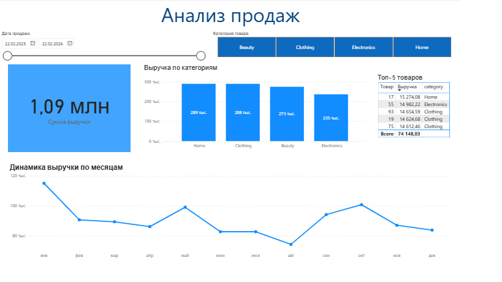
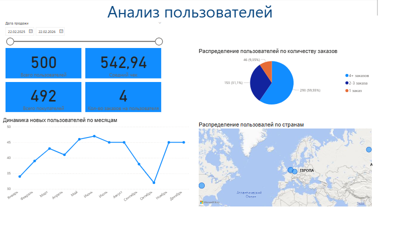

# Анализ интернет-магазина

## О проекте
Цель проекта — провести комплексный анализ продаж интернет-магазина, оценить ключевые бизнес-метрики (выручка, средний чек, ARPU), проанализировать поведение пользователей и выявить точки роста.

## Используемые инструменты
- PostgreSQL
- pgAdmin
- SQL
- Power BI 

## Источник данных: 
Тестовый датасет

## Ограничения проекта
- Данные синтетические
- Нет информации о маркетинговых каналах
- В датасете отсутствует информация о возвратах и частичных возвратах, поэтому рассчитанная выручка может быть завышена по сравнению с реальными бизнес-данными.

## Структура данных
Проект включает 4 таблицы:
- users - информация о пользователях (user_id, дата регистрации)
- orders -  заказы пользователей (order_id, user_id, дата заказа, статус, выручка)
- order_items - состав заказов (order_id, product_id, количество)
- products -  информация о товарах (product_id, категория, цена, себестоимость)

## Расчет ключевых метрик
- Общая выручка = SUM(revenue) 
- Средний чек = Общая выручка / Количество выполненных заказов
- ARPU = Общая выручка / Общее количество пользователей 
- Частота покупок = Всего заказов / всего пользователей
- Маржа = revenue - cost
- Маржинальность товара = (revenue - cost)/revenue 
В расчетах учитываются только заказы со статусом 'completed'.

# Анализ

## Основные метрики
- Общее количество пользователей
- Общее количество заказов
- Количество выполненных заказов
- Общая выручка по выполненным заказам
- Средний чек
- ARPU (средняя выручка на пользователя)

## Анализ поведения пользователей
- Сегментация пользователей: новые vs повторные (Сегментация проводится среди пользователей, совершивших хотя бы один completed заказ)
- Среднее количество заказов на пользователя
- Частота покупок по месяцам
- Сегментация по количеству заказов (пользователи с 1 заказом, с 2-4 заказами, с 5+ заказами, средний чек и выручка в каждой группе)
- Retention по месяцам (сколько пользователей вернулось)

## Анализ товаров
- Количество продаж по товарам
- Общая выручка по каждому товару
- Доля товара в общей выручке
- Средний чек по товару
- Топ-10 товаров по выручке
- Топ-10 товаров по количеству продаж
- Топ-5 товаров по маржинальности 
- ABC-анализ 

## Визуализация
Дашборд включает:
- Анализ продаж: сумма выручки, динамика выручки по месяцам, выручка по категориям, ТОП-5 товаров

- Анализ пользователей: количество пользователей, средний чек, динамика количества пользователей по месяцам, география пользователей

## Ключевые выводы
1. Выручка демонстрирует колебания по месяцам без устойчивого тренда роста. Наблюдаются периоды снижения (например, летом) и последующего восстановления, что может указывать на сезонность спроса.
2. Основную выручку формируют категории Home и Clothing. Это может говорить о более высоком спросе или лучшей ценовой доступности товаров этих категорий.
3. Выручка распределена относительно равномерно между топ-товарами, без явного доминирования одного продукта. Это снижает зависимость бизнеса от отдельных позиций.
4. Общее количество пользователей превышает количество покупателей, что указывает на неполную конверсию в покупку.
5. Количество новых пользователей стабильно по месяцам, без резких скачков или спада. 
6. Средний доход на пользователя (ARPU) остаётся стабильным, что говорит об устойчивой модели монетизации, но без выраженного роста.
7. Проведен ABC-анализ товаров на основе накопительной доли выручки. Товары сегментированы на группы A (80% выручки), B (15% выручки), C (5% выручки).
